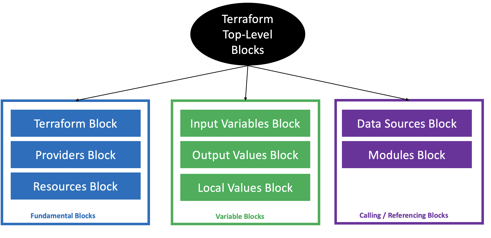

# Terraform Configuration Language Syntax

## Step-01: Terraform Configuration Language Syntax
- Terraform Language Basics
    - Terraform coding is Block based Structure. 
    - Each Block starts with BLOCK_TYPE and with/without BLOCK_LABELS and with open curly bracket - {
    -  Each Block ends with close curly bracket -    }
    - Each Block has BODY. i.e. Argument Name and Argument Value

- [Terraform Configuration](https://www.terraform.io/docs/configuration/index.html)
- [Terraform Configuration Syntax](https://www.terraform.io/docs/configuration/syntax.html)
```t
# Template
<BLOCK TYPE> "<BLOCK LABEL>" "<BLOCK LABEL>"   {
  # Block body
  <IDENTIFIER> = <EXPRESSION> # Argument
}

# AWS Example
resource "aws_instance" "ec2demo" { # BLOCK
  ami           = "ami-04d29b6f966df1537" # Argument
  instance_type = var.instance_type # Argument with value as expression (Variable value replaced from varibales.tf
}
```
## Terraform Blocks



## Arguments
- Argument Names and Values are based on Cloud/Target Platform
- Argument Value can be either of below Data Types

  - Number -> 10  (without double quotes)
    - Example,   count = 2
  - String  -> “some-text” (with double quotes)
    - Example, region = “ap-south-1”
  - Boolean -> True or False
    - Example, public_ip_address = True
  - List -> [……] (more than one value)
    - Example, network_interface_ids = [“nw1”,”nw2”,”nw3”]
  - Map -> {……} (more than one key value pair )
    ```
    Example, tags = {
		“env” = “Dev”
		“app_id” = “232423”
	              }
    ```
  - blocks -> {……} (more than one key value pair without Argument Name )
    ```
    Example,      os_disk {
		     name = "myOsDisk"
		     caching = "ReadWrite"
		      }
    ```

## Step-03: Understand about Arguments, Attributes and Meta-Arguments.
- Arguments can be `required` or `optional`
- Attribues format looks like `resource_type.resource_name.attribute_name`
- Meta-Arguments change a resource type's behavior (Example: count, for_each)
- [Additional Reference](https://learn.hashicorp.com/tutorials/terraform/resource?in=terraform/configuration-language) 
- [Resource: AWS Instance](https://registry.terraform.io/providers/hashicorp/aws/latest/docs/resources/instance)
- [Resource: AWS Instance Argument Reference](https://registry.terraform.io/providers/hashicorp/aws/latest/docs/resources/instance#argument-reference)
- [Resource: AWS Instance Attribute Reference](https://registry.terraform.io/providers/hashicorp/aws/latest/docs/resources/instance#attributes-reference)
- [Resource: Azure Virtual machine](https://registry.terraform.io/providers/hashicorp/azurerm/latest/docs/resources/virtual_machine#disclaimers)
- [Resource: Azure Argument Reference](https://registry.terraform.io/providers/hashicorp/azurerm/latest/docs/resources/virtual_machine#argument-reference)
- [Resource: Azure VM Attribute Reference](https://registry.terraform.io/providers/hashicorp/azurerm/latest/docs/resources/virtual_machine#attributes-reference)
- [Resource: Meta-Arguments](https://www.terraform.io/docs/language/meta-arguments/depends_on.html)

## Step-04: Understand about Terraform Top-Level Blocks
- Discuss about Terraform Top-Level blocks
  - Terraform Settings Block
  - Provider Block
  - Resource Block
  - Input Variables Block
  - Output Values Block
  - Local Values Block
  - Data Sources Block
  - Modules Block

